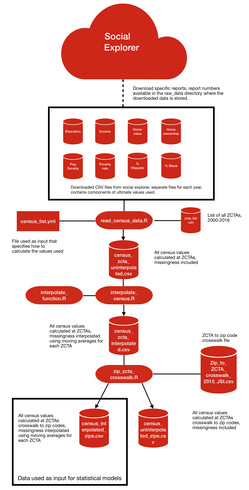

This directory contains a pipeline to produce a data set  with demographic information from the US Census and American Community Survey at the zip code level.

All data needed to recreate this data is provided in this directory.

## Raw Data
All source data is in the `raw_data` directory. The data was downloaded from the census social explorer website by Fei Carnes, a former research assistant working for Dr. Francesca Dominici, who assisted with geographically available data. All downloaded data is contained in the directory `raw_data/raw_census`. The data within that directory is stored with the structure `<variable>/<census or acs>/zcta/<year>`. In that directory is the CSV and readme downloaded from the Social explorer. To reacquire the source data, the same report number (found in the included readme) should be downloaded from social explorer.

Additionally in this directory we have a list of all ZCTAs (`zcta_list`) and a crosswalk going from ZCTAs
to zip code (`Zip_to_ZCTA_crosswalk_2015_JSI.csv`)

## Software Versions

- R base: 3.5.2
- dplyr: 1.0.6
= yaml: 2.2.1
- imputeTS: 3.0

## Code

All code is stored in the `code` directory.

The file `make.R` can be executed to recreate the processing steps that created census_interpolated_zips.csv

In brief, the steps are as follows:

1st: The variables which are spread out across multiple files are combined in to a single file. The layout files and the variables within 
them are indicated in `census_list.yml`. `read_census_data.R` is the code which creates the initial data set. As the source is US census data,
data points are located at ZCTAs rather than zip codes. Years without associated files are included as missing data.

2nd: Temporal interpolation is performed. interpolate_census.R performs this operation using functions from interpolate_function.R. 
A moving average is calculated within each ZCTA and used to fill in the missing years. See the ImputeTS for more details on the 
algorithm. Any rows that still have missing data (implying no data was available for the particular ZCTA) are discarded 
(around 200 zip codes were discarded).

3rd: A crosswalk file is used to link the ZCTAs in the data set to zip codes. This is done by zip_zcta_crosswalk.R

Data was available for the year 2000, and from 2011-2016. All other years were interpolated.

For the year 2000, we used data from the decennial census (including data from both the SF1 and SF3 summary files). For 2011 onward, we used data from the US Census ACS 5 year Estimates. Despite there being a decennial
census in 2010, and ACS data available for some geographies in 2009 and 2010, we did not use data for those years, as many of the variables we are interested in are only in the ACS, and ACS data is not available at the ZCTA level prior to 2011.

## Census Pipeline Output

The directory `processed_data` is left empty as the final products of the census
pipeline are larger than Github's file size limit. However running the 
`make.R` file in the `code` directory will recreate the final products. The files created
will be the following:

- census_zcta_uninterpolated.csv: Demographic values calculated at the ZCTA level, includes missingness
- census_zcta_interpolated.csv: Demographic values calculated at the ZCTA level, with missing values replaced
    by a moving average model for each ZCTA.
- census_uninterpolated_zips.csv: Demographic values cross-walked from the ZCTA level to zip codes, includes missingness
- census_interpolated_zips.csv: Demographic values cross-walked from ZCTA to zip codes, with missing values replaced by a moving average model for each ZCTA.

Variables in the output data set:

- `poverty`: % of the population older than 65 below the poverty line
- `popdensity`: population density per square mile
- `medianhousevalue`: median value of owner occupied properties
- `pct_blk`: % of the population listed as black
- `medhouseholdincome`: median household income
- `pct_owner_occ`: % of housing units occupied by their owner
- `hispanic`: % of the population identified as Hispanic, regardless of reported race
- `education`: % of the population older than 65 not graduating from high school

Within this data set there are ~38,000 unique zip codes. There are around 47,000 unique zip codes in the unmerged medicare mortality
data set. This difference has been attributed to out of date and incorrect zip codes entered in to the medicare data set as the standard
list of zip codes nationally provided by ESRI only contains ~41,000 zip codes. When merging with the confounder data, ~0.2% of the medicare
data will be lost. This accounts to a loss of a similar proportion of individuals within the data.

## Diagram of the workflow

