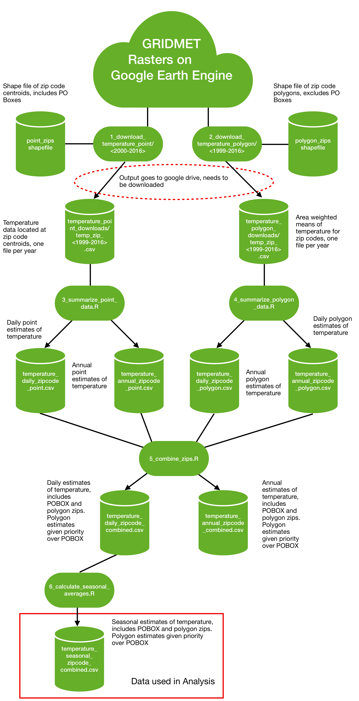

## Summary

The temperature and humidity data is sourced from the University of Idaho's GRIDMET project. We access it
using Google Earth Engine, where it is available as daily 4km x 4km rasters from January 1st, 2000 until the present.

To recreate the pipeline to get the GRIDMET temperature data from Google Earth Engine there are 
two major steps. The first step involves using Google Earth Engine to aggregate the
source data (splitting up the data into multiple files so that it can all be processed) to the zip code level and downloading the data. In the second step, we combine the downloaded files in to large single files and calculate seasonal and annual averages. 

## Download steps

First, upload zip code shape files to Google Earth Engine, 
we used the zip code centroids 
and polygons from ESRI for this. We provide the shape files we use for centroids, but the polygon shape 
file is too large to provide.Google Earth Engine doesn't
provide a means for direct download, so the final output files are exported to Google Drive. They then
must be individually downloaded and stored in a directory before proceeding with the next step. The files in the directories `code/1_download_temperature_point` and `code/2_download temperature_polygon` contain the code used to calculate daily zip code level temperature estimates on google earth engine and prepare those data for export to google drive. 

## Combining the files

First, we combine the daily files for each year for each zip code geography
(`code/3_summarize_point_data.R`, `code/summarize_polygon_data.T`) in to a single file. We also separately
calculate annual averages for each zip code at this time. The polygon zip code file only includes zip 
codes with non-zero area, resulting in around 8,000 fewer zip codes listed in that dataset. To resolve this 
issue, we create a combined file (`code/5_combine_zips.R`)where we use the centroid zip code estimate for 
all zip codes not present in the polygon estimate. We do this for both the daily and annual estimates. 
These combined datasets are the ones that we ultimately use in our studies, and use to calculate the 
seasonal averages (`code/6_calculate_seasonal_averages`)used in our study as well.

## Output Temperature Data

This directory should contain the output of the entire earth engine pipeline. Due to Github's 
storage constraints, we only include the annual data and the seasonal data ultimately used in the final analysis here. All data covers the period from Jan 1, 2000 to April 30th, 2020.

Those two data sets are as follows:
- `temperature_seasonal_zipcode_combined.csv`: Winter and summer mean daily max temperature and max relative humidity for all zip codes. Polygons are used to define zip code areas for area weighted means where possible, otherwise centroid estimates are used.
- `temperature_annual_zipcode_combined.csv`: Annual mean daily max temperature, precipitation, and humidity for all zip codes. Polygons are used to define zip code areas for area weighted means where possible, otherwise centroid estimates are used.

Additional data produced by the pipeline is as follows:
- temperature_annual_zipcode_centroid.csv: Annual mean temperature, precipitation, and humidity for all zip codes. The max temperature at the zip code centroid is used.
- temperature_annual_zipcode_polygon.csv: Annual mean daily max temperature, precipitation, and humidity for all zip codes. Area weighted means of the max temperature are used. Zip codes without defined polygons are excluded from this data set.
- temperature_daily_zipcode_centroid.csv: Daily max temperature values. The max temperature at the zip code centroid is used.
- temperature_daily_zipcode_combined.csv: Daily max temperature values. Polygons are used to define zip code areas for area weighted means where possible, otherwise centroid estimates are used.
- temperature_daily_zipcode_polygon.csv: Daily max temperature values. Area weighted means of the max temperature are used. Zip codes without defined polygons are excluded from this data set.

## Variables

#### Annual/daily Data

- `ZIP`: Zip Code
- `year`: year
- `tmmx`: Daily max temperature
- `rmax`: Daily max relative humidity
- `pr`: Daily total precipitation

#### Seasonal Data

- `ZIP`: Zip code
- `year`: year
- `summer_tmmx`: Mean summer daily max temperature
- `summer_rmax`: Mean summer daily max relative humidity
- `winter_tmmx`: Mean winter daily max temperature
- `winter_rmax`: Mean winter daily max relative humidity

## Diagram of workflow

