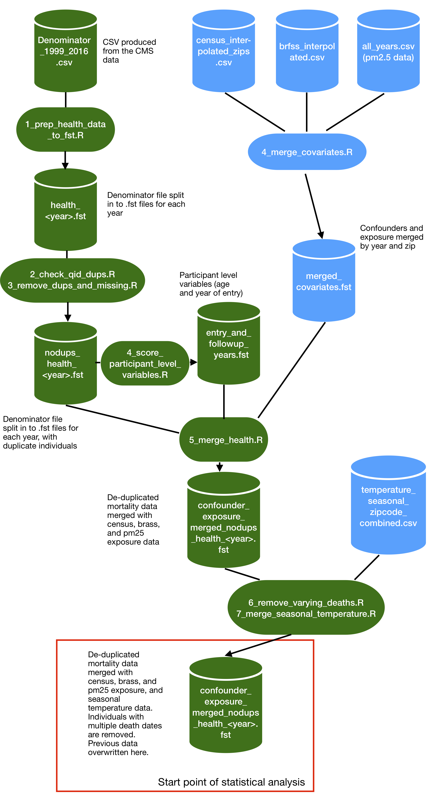

NSAPH 1999 through 2016 Data Merge
================
Ben Sabath
June 09, 2020

The code in this directory cleans and merges exposure, covariate, and
health data to produce combined data sets covering the period from
1999-2016 that can be used to estimate the effects of air quality
exposures on health outcomes.

## Inputs

As input to the merge the process takes the following files, produced in
the other processes contained in this repository: -
`Denominator_1999_2016.csv`: The medicare beneficiary enrollment file
from 1999-2016. The code producing this is in the `HealthOutcomes`
directory. We are unable to share this due to the private nature of the
data. - `census_interpolated_zips.csv`: The interpolated census
confounder data covering the period from 1999-2016. The code and source
data producing this file is available in the `Confounders/census`
directory. This file is too large to be shared on github in the form we
merge. However, by running the provided code on the available source
data, it can be recreated. - `brfss_interpolated.csv`: The interpolated
BRFSS (county level smoking rate and mean BMI) data from 1999-2016. The
workflow creating this file is in `Confounders/brfss`. The source data
is too large to share on github; however, we provide instructions for
downloading it, the code we use to create the final data set, and the
final data set. - `all_years.csv`: This file contains estimates of
annual pm2.5 exposure for each zip code covering the period from
2000-2016. We do not yet have permission from Joel Schwartz to share
this data, but a description of the creation of the data, and some
secondary processing code are available in the `Exposures` directory. -
`temperature_seasonal_zipcode_combined.csv`: This file contains summer
and winter temperature and humidity covering the period from 2000 until
the end of winter 2020. The workflow producing this data is available in
`Confounders/earth_engine`. The source data is again too large to share,
but we share the code we run on google earth engine to produce the data,
as well as the rest of the code we use, and the final products.

## Workflow overview

The basic workflow is illustrated in the figure below.

The process is as follows. First, in `1_prep_health_data_to_fst.R`, the
CSV file containing the health data is split in to multiple `.fst`
files, one for each year. Next, we have to deal with duplicate
individuals in the data set. Given that the data we receive from
medicare is administrative in nature and not prepared for research, we
observe some instances of the same individual appearing multiple times
in a single year (which should not happen in the beneficiary summary
data). `2_check_qid_dups.R` quantifies the scale of the duplicates, then
`3_remove_dups and missing.R` removes the duplicates. The system for
removing duplicates first removes observations with more missing
information than other observations. Following that, of the remaining
duplicates with equivalent levels of missingness, one observation is
randomly selected to be kept. Next we prepare the confounder and
exposure data sets for merging with the health data in
`4_merge_coviariates.R`, where all of the confounders are merged on zip
code and year so that only a single join needs to be performed with the
larger health data set. We additionally calculate individual level
variables here (first year that the individuals appear in the cohort,
age at entry in to the cohort) that are needed in later analysis
(`4_score_participant_variables.R`). The next step (`5_merge_health.R`)
is the large merge, where we join the participant level variables with
the person-year data in the beneficiary summary file on individual ID and
join the zip code level exposure and confounders with the beneficiary
file on the basis of zip code of residence and year.

Following this step and after initially using this data in our analysis,
we observed that some individuals in the cohort had multiple days of
death on record. The code in `6_remove_varying_deaths.R` excludes these
individuals entirely from our data set, as we cannot be confident about
which is the true date of death. Finally, we realized that seasonal
temperature and humidity data would also improve our analysis, so in
`7_merge_seasonal_temperature.R` we add those variables in. **The files
produced at the end of this script are what are used as input for the
statistical analysis.**
