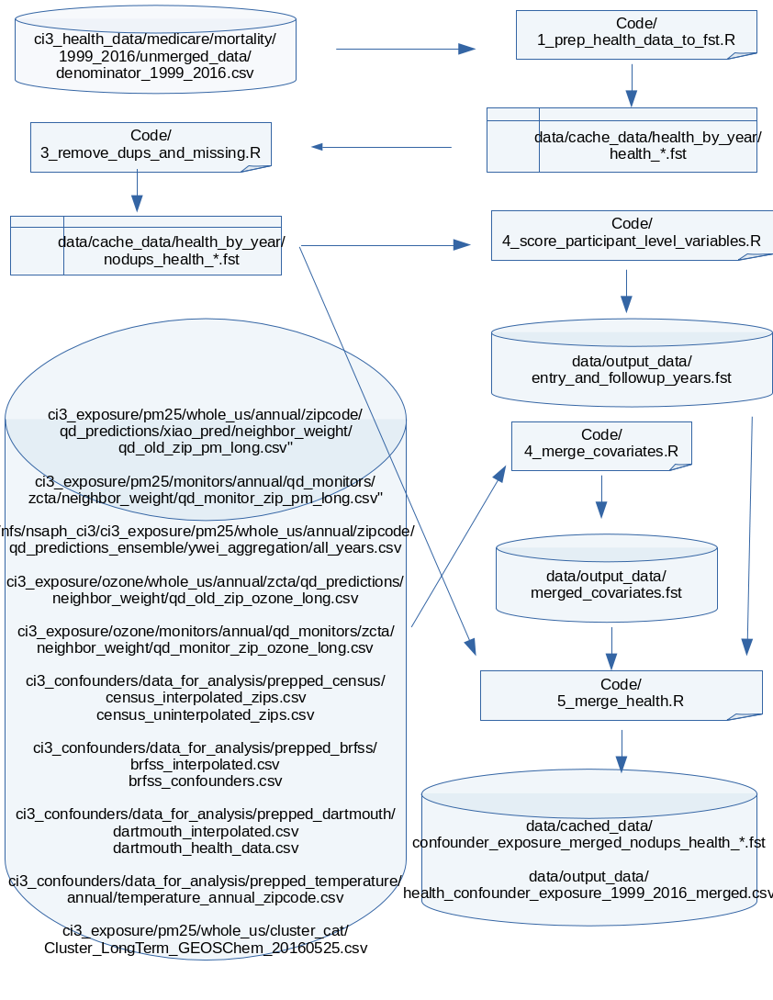

NSAPH 1999 through 2016 Data Merge
================
Ista Zahn and Ben Sabath
Initial: 05/02/2019, Updated November 01, 2019

## Update October/November 2019

By Ben Sabath

A number of researchers pointed out an issue with individuals having
multiple dates of death recorded in the merged data. To prevent
researchers from having to adjust for these individuals in all of their
work, a second version of the data was created using the code in
[9\_remove\_varying\_deaths.R](code/9_remove_varying_deaths.R) which
identifies individuals with multiple death days and removes them from
the data set. 34899 unique individuals were removed from the data set.
Death dates in years not corresponding to the year of the observation
were also set to be the empty string. Individuals who have died also
have all future observations tied to them removed.

Additionally, [code](code/10_merge_seasonal_temperature.R) was written
to merge in the newly created seasonal averages for temperature and
humidity.

The updated data is available at:
`ci3_health_data/medicare/mortality/1999_2016/wu/cache_data/merged_by_year_v2`

## Original Readme:

The project cleans and merges exposure, covariate, and health data to
produce combined data sets that can be used to estimate the effects of
air quality exposures on health outcomes. It extends the work done in
[exp\_covar\_health\_merge\_april2019](../exp_covar_health_merge_april2019/)
to include all years from 1999 through 2016
([exp\_covar\_health\_merge\_april2019](../exp_covar_health_merge_april2019/)
only included 200 through 2012 for to facilitate comparisons to
previously published work; see
[exp\_covar\_health\_merge\_april2019/readme.html](../exp_covar_health_merge_april2019/readme.html)
for details).

# Workflow overview

The basic workflow is illustrated in the figure below.



# Data dictionary and variable documentation

Information about the source, processing, and values of each variable
are available in the [codebook](./doc/codebook.csv). More detailed
information about each variable, and a comparison with those produced
for are available in the [descriptive
statistics](./results/merged_stats_check.csv). \# Working with these
data

The data produced here are stored in a flat `.csv` file at
`ci3_health_data/medicare/mortality/1999_2016/wu/output_data/health_confounder_exposure_1999_2016_merged.csv`.
This file is however very large (around 310 GB) and may contain
variables you are not interested in. If you are working with these data
in R you can used the cached data stored in
`ci3_health_data/medicare/mortality/1999_2016/wu/cache_data/merged_by_year`
to selectively read columns much more quickly. The data in this
directory are in `fst` format: see the [fst package
website](https://www.fstpackage.org/) for details.

The example below demonstrates how to work more efficiently with these
data by reading in only select columns.

First, get the list of files (there is one file per
year).

``` r
f <- list.files("/nfs/nsaph_ci3/ci3_health_data/medicare/mortality/1999_2016/wu/cache_data/merged_by_year",
                pattern = "\\.fst",
                full.names = TRUE)
```

Next, get the list of available columns. Refer to the [descriptive
statistics](./results/merged_stats_check.csv) for details.

``` r
library(fst)
library(data.table)

## the columns available are the same in each year.
metadata_fst(f[[1]])
```

    ## <fst file>
    ## 33565642 rows, 60 columns (confounder_exposure_merged_nodups_health_1999.fst)
    ## 
    ## * 'year'                        : integer
    ## * 'zip'                         : integer
    ## * 'qid'                         : character
    ## * 'dodflag'                     : character
    ## * 'bene_dod'                    : character
    ## * 'sex'                         : integer
    ## * 'race'                        : integer
    ## * 'age'                         : integer
    ## * 'hmo_mo'                      : character
    ## * 'hmoind'                      : character
    ## * 'statecode'                   : character
    ## * 'latitude'                    : double
    ## * 'longitude'                   : double
    ## * 'dual'                        : character
    ## * 'death'                       : integer
    ## * 'dead'                        : logical
    ## * 'entry_age'                   : integer
    ## * 'entry_year'                  : integer
    ## * 'entry_age_break'             : integer
    ## * 'followup_year'               : double
    ## * 'followup_year_plus_one'      : double
    ## * 'pm25_ensemble'               : double
    ## * 'pm25_no_interp'              : double
    ## * 'pm25_nn'                     : double
    ## * 'ozone'                       : double
    ## * 'ozone_no_interp'             : double
    ## * 'zcta'                        : integer
    ## * 'poverty'                     : double
    ## * 'popdensity'                  : double
    ## * 'medianhousevalue'            : double
    ## * 'pct_blk'                     : double
    ## * 'medhouseholdincome'          : double
    ## * 'pct_owner_occ'               : double
    ## * 'hispanic'                    : double
    ## * 'education'                   : double
    ## * 'population'                  : double
    ## * 'zcta_no_interp'              : integer
    ## * 'poverty_no_interp'           : double
    ## * 'popdensity_no_interp'        : double
    ## * 'medianhousevalue_no_interp'  : double
    ## * 'pct_blk_no_interp'           : double
    ## * 'medhouseholdincome_no_interp': double
    ## * 'pct_owner_occ_no_interp'     : double
    ## * 'hispanic_no_interp'          : double
    ## * 'education_no_interp'         : double
    ## * 'population_no_interp'        : integer
    ## * 'smoke_rate'                  : double
    ## * 'mean_bmi'                    : double
    ## * 'smoke_rate_no_interp'        : double
    ## * 'mean_bmi_no_interp'          : double
    ## * 'amb_visit_pct'               : double
    ## * 'a1c_exm_pct'                 : double
    ## * 'amb_visit_pct_no_interp'     : double
    ## * 'a1c_exm_pct_no_interp'       : double
    ## * 'tmmx'                        : double
    ## * 'rmax'                        : double
    ## * 'pr'                          : double (key 1)
    ## * 'cluster_cat'                 : character
    ## * 'fips_no_interp'              : integer
    ## * 'fips'                        : integer (key 2)

Finally, selectively read in just those columns needed for your analysis
using code snippet below.

``` r
myvars <- c("year", "zcta", "age")
exd <- rbindlist(lapply(f[1:5],
                        read_fst,
                        columns = myvars,
                        as.data.table=TRUE))
```

Since we only read in a few columns, this operation is (relatively) fast
and takes less than 10 GB of memory (reading more columns will of course
take more resources).

If you wish to work with regular R `data.frame` instead of `data.table`,
it is still recommended to use the `as.data.table = TRUE` argument to
`read_fst`. You can convert the result to a `data.frame` after the
`rbindlist` part if you wish:

``` r
setDF(exd)
str(exd)
```

    ## 'data.frame':    170040022 obs. of  3 variables:
    ##  $ year: int  1999 1999 1999 1999 1999 1999 1999 1999 1999 1999 ...
    ##  $ zcta: int  NA NA NA NA NA NA NA NA NA NA ...
    ##  $ age : int  72 72 72 71 98 75 98 67 81 98 ...

# Questions or comments

Questions or comments about these data or the process used to create
them should be reported [on the github issue
tracker](https://github.com/NSAPH/data_requests/issues).
